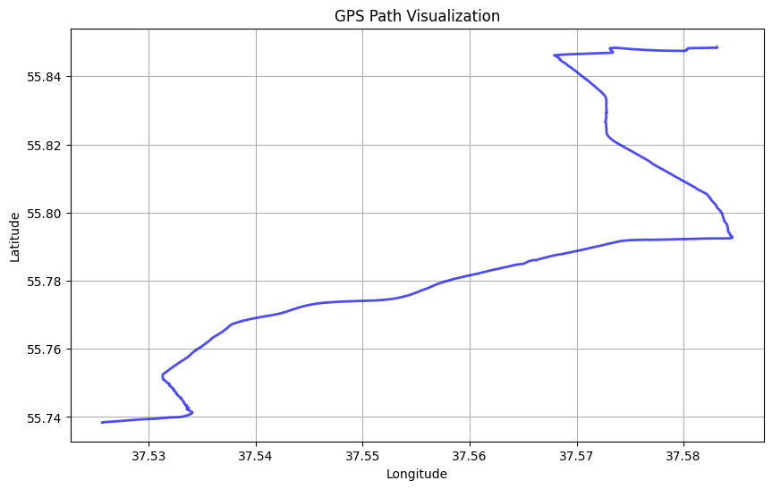
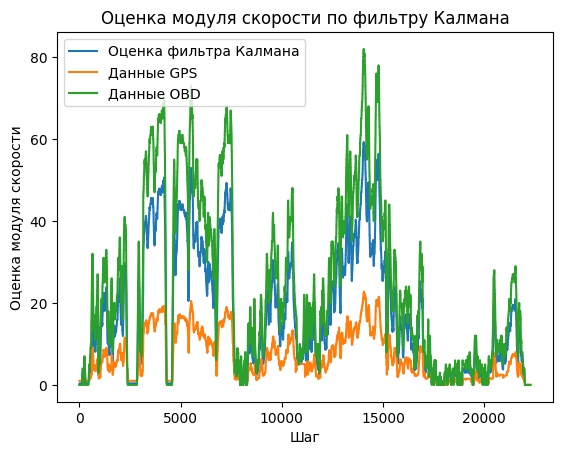
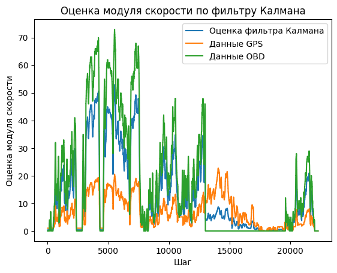
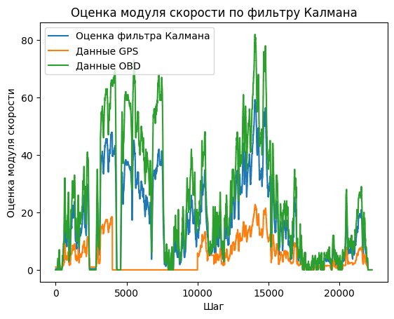
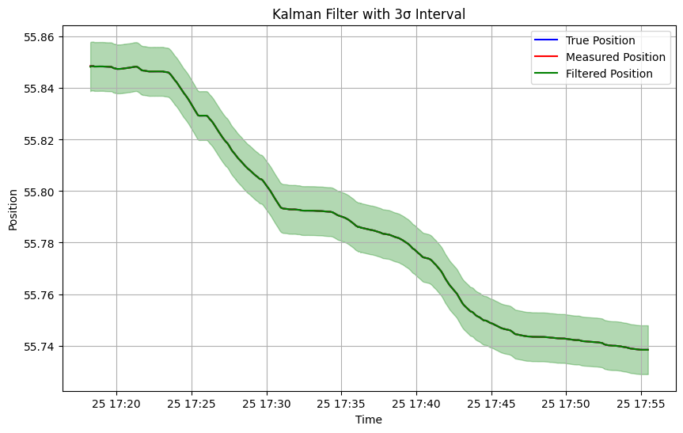

# Kalman Filter: GPS + OBD Sensor Fusion

Kalman filter experiments on a real 37-minute car trip. The log combines GPS (coordinates, speed, heading) with speed read from the car's OBD-II port, recorded about 10 times per second (22,000 rows). The filters fuse the two speed sources, test what happens when one sensor fails, and smooth the position.

## Data

[`public/data1.csv`](public/data1.csv) — the columns used in the experiments:

| Column | Meaning |
|---|---|
| `Latitude`, `Longitude` | GPS coordinates |
| `GPS Speed (Meters/second)` | Speed from GPS |
| `Speed (OBD)(km/h)` | Speed from the car's OBD-II port |
| `Bearing` | Heading in degrees |
| `G(x)`, `G(y)`, `G(z)` | Accelerometer |

## Experiments

### 1. Route

The recorded trip plotted from GPS coordinates.

<p align="center"></p>

### 2. Fusing GPS and OBD speed

A one-dimensional Kalman filter: GPS speed drives the prediction step, OBD speed is used as the measurement. The blue line is the fused estimate.

<p align="center"></p>

### 3. Sensor dropout

What happens to the estimate when one of the sensors stops working. On the left, OBD speed is forced to zero between 17:40 and 17:50. On the right, GPS speed is forced to zero between 17:25 and 17:34.

<p align="center">
  
  
</p>

### 4. Position filtering

A two-state filter (position and velocity, constant-velocity model) applied to latitude. The green band is the 3σ confidence interval.

<p align="center"></p>

### 5. Visualizations

- **Speed map.** The notebook builds an interactive [folium](https://python-visualization.github.io/folium/) map with the route colored by speed, from red (slow) to green (fast). Maps are saved to `public/` and aren't committed: each one is about 12 MB.
- **Heading.** [`orientation.py`](orientation.py) opens a pygame window with an arrow that rotates according to the recorded heading.

## Getting started

```bash
git clone https://github.com/Palmson/Kalman-filter.git
cd Kalman-filter
pip install -r requirements.txt
```

Open `main.ipynb` in Jupyter or VS Code and run the cells. To see the heading animation, run:

```bash
python orientation.py
```

## Project structure

```
Kalman-filter/
├── main.ipynb          # Experiments: route, speed fusion, sensor dropout, position filter, maps
├── orientation.py      # Heading animation with pygame
├── public/
│   ├── data1.csv       # Trip log (GPS + OBD)
│   └── arrow.png       # Arrow sprite for orientation.py
├── docs/               # Plots for this README
└── requirements.txt
```

## Roadmap

- [ ] Convert units before fusion: GPS speed is in m/s and OBD speed is in km/h, so the filter currently mixes different units
- [ ] Use a separate reference and noisy measurements in the position demo (right now both are the same series)
- [ ] Fix the column selection error in the first speed-filter cell and remove the unfinished map animation cells
- [ ] Add accelerometer data to the filter
